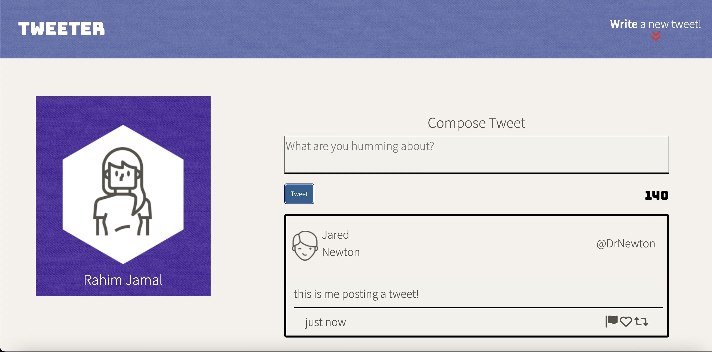
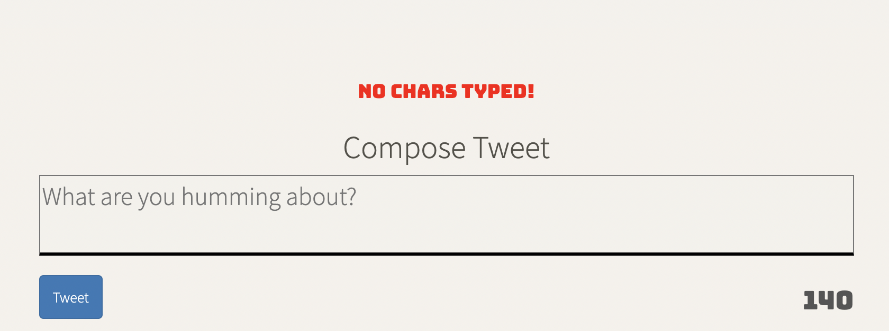
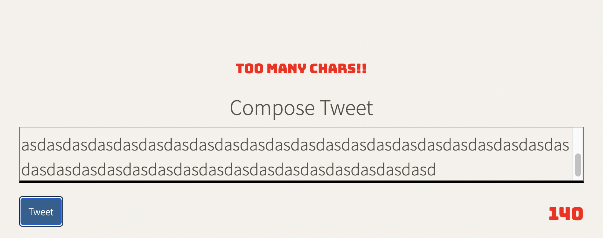

# Tweeter Project

Tweeter is a simple, single-page Twitter clone.

This repository is built upon my HTML, CSS, JS, jQuery and AJAX front-end skills, and my Node, Express back-end skills.

## Getting Started

1. [Create](https://docs.github.com/en/repositories/creating-and-managing-repositories/creating-a-repository-from-a-template) a new repository using this repository as a template.
2. Clone your repository onto your local device.
3. Install dependencies using the `npm install` command.
3. Start the web server using the `npm run local` command. The app will be served at <http://localhost:8080/>.
4. Go to <http://localhost:8080/> in your browser.

## Dependencies

- Express
- Node 5.10.x or above

## Screenshots
# 1. This is my Tweeter Desktop Page!
 
# 2. This is my Tweeter Mobile Page! 

# 3 These are screenshots of the Errors! (If nothing is typed or too much was typed!)

# 4 This is me posting a tweet!!!

